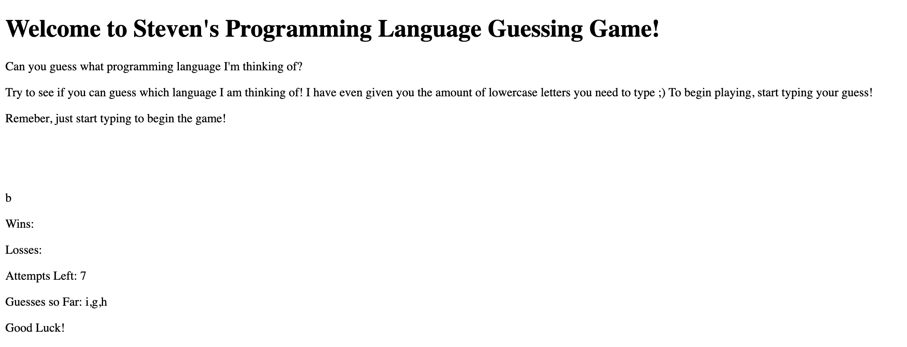
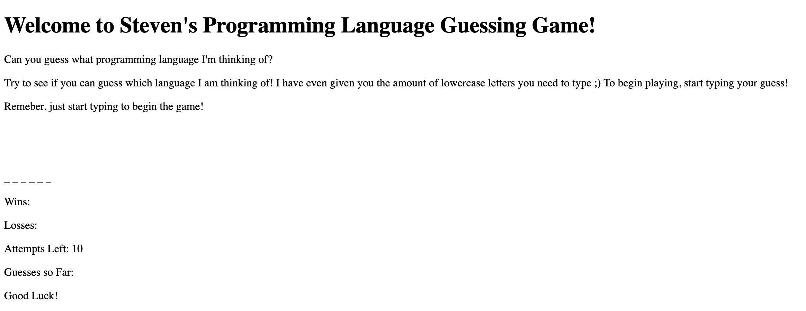

# # coding-language-guessing-game

This repo contains my first Javascript trivia game. You will need to play the game through the Git Pages link. There you will be prompted with instructions on how to play. Enjoy! (PLEASE NOTE: THIS GAME IS INCOMPLETE AND WILL BE UPDATED SOON!)

## Getting Started

To play the game, simply click the deployed link below. The object of the game is to guess the hidden word marked by the underscores. Simply type a letter to begin. 

## Deployment
https://stevencmann2.github.io/coding-language-guessing-game/ . 

## Photos of the App

  
 

 
